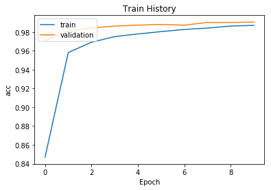
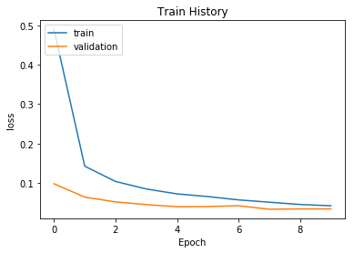
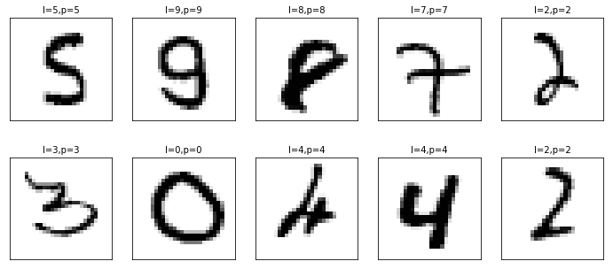
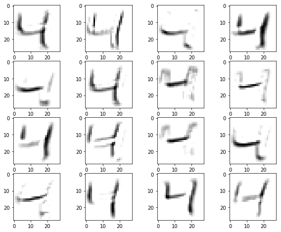
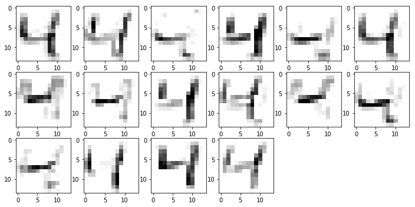
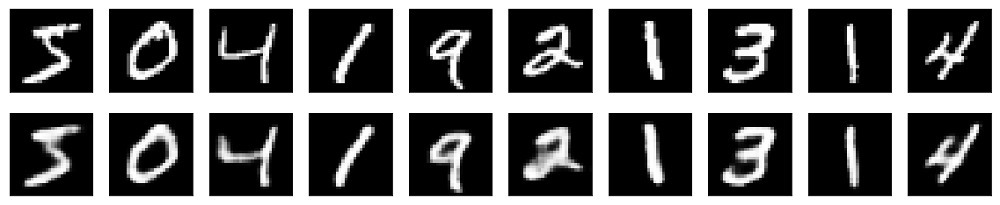
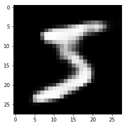
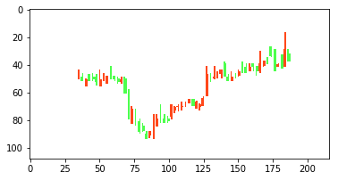

# 巨量期末

組員

## 大綱

本次報告大綱分為以下部分：

- CNN Mnist實作
- CAE實作 Mnist實作
- 以K線圖實作CAE

## CNN Mnist實作

### CNN 介紹

CNN可以藉由Filter來提取圖片的特徵，而且比起一般的MLP，Filter可以更有效率提取一區塊的特徵，比起直接拿MLP去學可以減少很多參數訓練，下圖的過程被稱為Convolution。


每一個Filter的參數都是可以學習的，每次進行Convolution都有很多個Filter，故會讓Feature Map越來越厚，如下圖。


除了Convolution，還有Max-pooling的方法，可以讓圖片維度變小


### CNN訓練


一開始先把MNIST資料讀取進來，讀取進來就是array格式。

```python
from keras.datasets import mnist  
from keras.utils import np_utils  
import numpy as np  
import tensorflow as tf
np.random.seed(10)  
```


```python
# Read MNIST data  
(X_Train, y_Train), (X_Test, y_Test) = mnist.load_data()  
```

```python
X_Train.shape
```

    (60000, 28, 28)
這樣代表60000個樣本，每個樣本是28*28的pixel  array。

```python
# Translation of data  
X_Train40 = X_Train.reshape(X_Train.shape[0], 28, 28, 1).astype('float32')  
X_Test40 = X_Test.reshape(X_Test.shape[0], 28, 28, 1).astype('float32')
```
但是因為圖片是用RGB三層疊起來的，所以圖片是有「高度的」，想讓Keras能夠讀取我們的資料就要將圖片28\*28的圖片變成28\*28*1（因為MNIST是黑白的所以只有一個chanel）

```python
# Standardize feature data  
X_Train40_norm = X_Train40 / 255  
X_Test40_norm = X_Test40 /255  
  
# Label Onehot-encoding  
y_TrainOneHot = np_utils.to_categorical(y_Train)  
y_TestOneHot = np_utils.to_categorical(y_Test)  
```

接著上面程式碼就是將每個array的數字都進行0~1之間的標準化

```python
from keras.models import Sequential  
from keras.layers import Dense,Dropout,Flatten,Conv2D,MaxPooling2D  
  
model = Sequential()  
# 生成一個模型序列，借用add一層一層疊上去

# Create CN layer 1  
model.add(Conv2D(filters=16,  
                 kernel_size=(5,5),  
                 padding='same',
                 #會將原圖片array以0填充，讓Conv前後的圖片大小都一致

                 input_shape=(28,28,1),  
                 activation='relu'))  
# Create Max-Pool 1  
model.add(MaxPooling2D(pool_size=(2,2)))  
  
# Create CN layer 2  
model.add(Conv2D(filters=36,  
                 kernel_size=(5,5),  
                 padding='same',  
                 input_shape=(28,28,1),  
                 activation='relu'))  
  
# Create Max-Pool 2  
model.add(MaxPooling2D(pool_size=(2,2)))  
  
# Add Dropout layer  
model.add(Dropout(0.25))
model.add(Flatten()) 

# 將三維feature map矩陣拉長成一維向量進行MLP

model.add(Dense(128, activation='relu'))  
model.add(Dropout(0.5))  
model.add(Dense(10, activation='softmax'))  
model.summary() 

```


```python
# 定義訓練方式  
model.compile(loss='categorical_crossentropy', optimizer='adam', metrics=['accuracy'])  
  
# 開始訓練  
train_history = model.fit(x=X_Train40_norm,  
                          y=y_TrainOneHot, validation_split=0.2,  
                          epochs=10, batch_size=300, verbose=2)  
```

這段程式碼可以將像素矩陣用matplotlib畫出來

```python
import os    
import matplotlib.pyplot as plt  

def plot_image(image):  
    fig = plt.gcf()  
    fig.set_size_inches(2,2)  
    plt.imshow(image, cmap='binary')  
    plt.show()  
```

這段程式碼是將前10個圖片畫出來，並對照Label與預測值。
```python
def plot_images_labels_predict(images, labels, prediction, idx, num=10):  
    fig = plt.gcf()  
    fig.set_size_inches(12, 14)  
    if num > 25: num = 25  
    for i in range(0, num):  
        ax=plt.subplot(5,5, 1+i)  
        ax.imshow(images[idx], cmap='binary')  
        title = "l=" + str(labels[idx])  
        if len(prediction) > 0:  
            title = "l={},p={}".format(str(labels[idx]), str(prediction[idx]))  
        else:  
            title = "l={}".format(str(labels[idx]))  
        ax.set_title(title, fontsize=10)  
        ax.set_xticks([]); ax.set_yticks([])  
        idx+=1  
    plt.show()  
```

這段程式碼可將訓練過程的測試集與驗證集的ACC、loss畫出來。

```python
def show_train_history(train_history, train, validation):  
    plt.plot(train_history.history[train])  
    plt.plot(train_history.history[validation])  
    plt.title('Train History')  
    plt.ylabel(train)  
    plt.xlabel('Epoch')  
    plt.legend(['train', 'validation'], loc='upper left')  
    plt.show()  
```


```python
show_train_history(train_history, 'acc', 'val_acc')  
show_train_history(train_history, 'loss', 'val_loss')
```







用summary即可觀看模型結構。

```python
model.summary()
```

    _________________________________________________________________
    Layer (type)                 Output Shape              Param #
    =================================================================
    conv2d_5 (Conv2D)            (None, 28, 28, 16)        416  
    _________________________________________________________________
    max_pooling2d_5 (MaxPooling2 (None, 14, 14, 16)        0   

    _________________________________________________________________
    conv2d_6 (Conv2D)            (None, 14, 14, 36)        14436
    _________________________________________________________________
    max_pooling2d_6 (MaxPooling2 (None, 7, 7, 36)          0         
    _________________________________________________________________
    dropout_4 (Dropout)          (None, 7, 7, 36)          0         
    _________________________________________________________________
    flatten_2 (Flatten)          (None, 1764)              0         
    _________________________________________________________________
    dense_3 (Dense)              (None, 128)               225920    
    _________________________________________________________________
    dropout_5 (Dropout)          (None, 128)               0         
    _________________________________________________________________
    dense_4 (Dense)              (None, 10)                1290      
    =================================================================
    Total params: 242,062
    Trainable params: 242,062
    Non-trainable params: 0
    _________________________________________________________________

接著我們將模型只運行到進行第一次Convolution後，來看看經過Filter的圖片會變成什麼樣子。

```python
for_show = X_Train.reshape(X_Train.shape[0], 28, 28, 1).astype('float32')
from keras.models import Model
layer_name = 'conv2d_5'
conv2d_5_layer_model = Model(inputs=model.input,
                            outputs=model.get_layer(layer_name).output)
conv2d_5_output = conv2d_5_layer_model.predict(for_show)
```


```python
fig = plt.gcf()  
fig.set_size_inches(10, 8)  
for i in range(0,16):
    ax = fig.add_subplot(4,4,i+1) 
    ax.imshow(conv2d_5_output[2,:,:,i], cmap='binary') 

```



可以發現Filter會試著把數字的邊緣、筆畫、轉折提取出來！

接下來來實證經過Max-pooling後的圖片會變得如何。

```python
layer_name = 'max_pooling2d_5'
max_pooling2d_5_layer_model = Model(inputs=model.input,
                                 outputs=model.get_layer(layer_name).output)
max_pooling2d_5_output = max_pooling2d_5_layer_model.predict(for_show)
```

```python
fig2 = plt.gcf()
fig2.set_size_inches(12, 12)  
for i in range(0,16):
    ax = fig2.add_subplot(6,6,i+1) 
    ax.imshow(max_pooling2d_5_output[2,:,:,i], cmap='binary') 
```

圖片會變小，但是Filter的大小還是變，這樣代表這樣可以去提取更細部的特徵。



## CAE實作 Mnist實作

### Autoencoder介紹

我們是否可以建構以下的模型：將高維度的資料丟入NN，NN的結構會越縮越小將維度降低，並可以將降維後的東西還原到初始的資料模樣？


Autoencoder就是訓練這樣的NN，它可以像PCA一樣降維，並可以用訓練好的解碼網路還原到原來的模樣。

但是Autoencoder是一個概念，既然Convolution可以很好地處理圖片資料，何不用來建構Convolution Autoencoder?

## CAE實作

我們利用Maxpooling將圖片降維，到encoded為止就是降維的模型，最後將降維後的東西利用UpSampling來升維，最後變回跟圖片一樣的維度。

有一點要注意，實證上`binary_crossentropy`是比較適合的loss function，用RMSE會讓效果變不好。

```python
from keras.layers import Input, Dense, Conv2D, MaxPooling2D, UpSampling2D
from keras.models import Model
from keras import backend as K
from keras.datasets import mnist
import numpy as np

input_img = Input(shape=(28, 28, 1)) 

x = Conv2D(16, (3, 3), activation='relu', padding='same')(input_img)
x = MaxPooling2D((2, 2), padding='same')(x)
x = Conv2D(8, (3, 3), activation='relu', padding='same')(x)
x = MaxPooling2D((2, 2), padding='same')(x)
x = Conv2D(8, (3, 3), activation='relu', padding='same')(x)
encoded = MaxPooling2D((2, 2), padding='same')(x)


x = Conv2D(8, (3, 3), activation='relu', padding='same')(encoded)
x = UpSampling2D((2, 2))(x)
x = Conv2D(8, (3, 3), activation='relu', padding='same')(x)
x = UpSampling2D((2, 2))(x)
x = Conv2D(16, (3, 3), activation='relu')(x)
x = UpSampling2D((2, 2))(x)
decoded = Conv2D(1, (3, 3), activation='sigmoid', padding='same')(x)

autoencoder = Model(input_img, decoded)
autoencoder.compile(optimizer='adadelta', loss='binary_crossentropy')

```

最後就是模型的訓練了

```python
from keras.callbacks import TensorBoard
(x_train, _), (x_test, _) = mnist.load_data()

x_train = x_train.astype('float32') / 255
x_test = x_test.astype('float32') / 255
x_train = np.reshape(x_train, (len(x_train), 28, 28, 1))  

x_test = np.reshape(x_test, (len(x_test), 28, 28, 1))  


autoencoder.fit(x_train, x_train,
                epochs=50,
                batch_size=128,
                shuffle=True,
                validation_data=(x_test, x_test),
                callbacks=[TensorBoard(log_dir='/tmp/autoencoder')])
```

再來就是將降維且還原過後的圖片畫出來，看看效果如何


```python
decoded_imgs = autoencoder.predict(x_train)
n = 10
plt.figure(figsize=(20, 4))
for i in range(n):

    ax = plt.subplot(2, n, i + 1)
    plt.imshow(x_train[i].reshape(28, 28))
    plt.gray()
    ax.get_xaxis().set_visible(False)
    ax.get_yaxis().set_visible(False)


    ax = plt.subplot(2, n, i + n + 1 )
    plt.imshow(decoded_imgs[i].reshape(28, 28))
    plt.gray()
    ax.get_xaxis().set_visible(False)
    ax.get_yaxis().set_visible(False)
plt.show()
```

上面的是原圖，下面是降維後還原回來的圖，效果還不錯。



我們也可以把encoder跟decoder拆開來：

將原來encoded模型結構跟上面input維度設定包成一個模型，即可讓圖片降維，`codes`就是降維後的圖片矩陣。

```python
encoder = Model(input_img, encoded)
codes = encoder.predict(x_train)
```

再來是剛剛訓練的`autoencoder`模型物件的後半段就是解碼器decoder，將後半段的模型結搆提取出來再包成模型就是解碼器。

```python
encoded_input = Input(shape=(4, 4, 8))
# retrieve the last layer of the autoencoder model
deco = autoencoder.layers[-7](encoded_input)
deco = autoencoder.layers[-6](deco)
deco = autoencoder.layers[-5](deco)
deco = autoencoder.layers[-4](deco)
deco = autoencoder.layers[-3](deco)
deco = autoencoder.layers[-2](deco)
deco = autoencoder.layers[-1](deco)
decoder = Model(encoded_input, deco)
```

```python
predict = decoder(codes)
plt.imshow(predict[0].reshape(28, 28))
```



## 以K線圖實作CAE

### 原由

受這篇論文啟發：Deep Stock Representation Learning: From Candlestick Charts to Investment Decisions

現代投資組合理論一開始由 Markowitz(1952) 提出Mean-Variance架構，找到效率前緣來建構投資組合，其中需要計算股票之間報酬率的Covariance Matrix，但大多數現有的股票相似度測量存在以下問題：

- 許多相似性度量（例如Covariance Matrix）的估計需要非常長的歷史數據（3000天），這不能有效地代表當前的市場 
- 無法捕捉到平移不變性(translation invariance) ，舉例來說蘋果股價可能某天漲，但是相關概念股票可能幾天後才漲。
- 許多方法無法捕捉時間序列的非線性特徵

為了解決這些問題，該論文使用卷積自動編碼器（Convolutional Autoencoder）來重新詮釋股票特徵，以取代原始的時間序列資料。

最後拿通過CAE的向量來進行群聚，找出走勢圖相近的群集，從各個群集挑出最好的股票，如此一來可以有風險對沖的效果。以上就是為什麼我們想先用手寫數字實作CNN跟CAE，最後再嘗試用K線圖實作CAE。

但囿於時間，以下是本次想達到的目標：

- 隨機挑選一支股票，再挑選該股票中某30天的股價資料
- 將上述做5000次，形成5000個隨機公司隨機日期區間的30天股票序列
- 將這5000個30天股票序列用matplotlib畫成K線圖再轉成像素矩陣

### 資料整理

這是從TEJ下載下來的股價資料，內容包含：

- 公司名
- 代號
- 日期
- 開盤價、最高價、最低價、收盤價
- 成交量
- 流通在外股數

```python
import pandas as pd
import os
os.chdir('/users/alex/Desktop/資料集/')

df = pd.read_csv('Stock_Daily_TW.txt',
encoding = 'CP950',
#有中文字的資料如果讀不進來，編碼試著改CP950八九不離十
sep = '\t',
low_memory=False,
#讀去較大資料需要設置此項
na_values=['       -'])
#將「-」符號用NA填補，以免無法轉成數字

df.columns = ['ticker', 'name', 'date', 'open', 'high', 'low', 'close', 'volume', 'shares']
```

將著我們就只挑選市值前300大的股票，因為雞蛋水餃股的線圖都會有點奇怪，以下是比較細部的資料整理細節。

```python
df['MV'] = df.close*df.shares
#算出市值


codelist = df[df.date==20180601]
codelist=codelist.sort_values(['MV'])
codelist=codelist.head(300)['ticker']
#用20180601市值前300的股票作為候選清單

df = df.sort_values(['ticker', 'date'])
#把df排序整理一下

df.date = pd.Series(df.date, dtype='str')
df.date = pd.to_datetime(df.date )
#將數字格式的日期，轉成python的日期格式，方便轉成matplotlib的時間格式
```

接著自訂一個可以隨機挑選公司跟日期區間的函數。

```python
def random_target(x,codelist, df):
  
    from matplotlib import dates

    target=codelist.take(np.random.permutation(len(codelist))[:1])
    #隨機挑選公司
    Firm=target.values[0]
    
    aaa=df[df.ticker==Firm]
    #將該公司所有股票資料取出

    target_date=aaa.take(np.random.permutation(len(aaa))[:1])
    
    limit=len(aaa)-61
    x=target_date.date.values[0]
    if x>aaa.date.values[limit]:
        
        while x<aaa.date.values[limit]:
            target_date=aaa.take(np.random.permutation(len(aaa))[:1])
            x=target_date.date.values[0]   
            
        begin_index=target_date.index[0]
        end_index=begin_index+60
        final=df.iloc[begin_index:end_index].copy()
 
    else:
        begin_index=target_date.index[0]
        end_index=begin_index+60
        final=df.iloc[begin_index:end_index].copy()
        
    final['num_date'] = final.date.apply(dates.date2num).values
    #多設一欄是matplotlib所接受的時間格式

    final = final[['ticker','date','num_date', 'open', 'high', 'low', 'close']].as_matrix()
    # 將dataframe轉成array，才能傳進matplotlib
    
    return final
```

上述函數回傳的是`['ticker','date1','num_date1', 'open1', 'high1', 'low1', 'close1'], ['ticker','date2','num_date2', 'open2', 'high2', 'low2', 'close2']...` 這樣格式的array。但是matplotlib只要num_date、開高低收，故設置`input_array[:, 2:7]`

因為直接用日期去畫matplotlib會把六日也畫上去，但是六日沒有交易資料，會形成斷點不好看，所以`weekday_quotes`會多加一個1,2,3,4...這樣的序列。用這個序列先當作tick來畫圖，再把tick對照到日期作為tick label，就不會有K線斷裂的情形，這步滿折騰的。

```python
def data_candlestick_array(input_array):
    data = input_array[:, 2:7]
    weekday_quotes = [tuple([i]+list(data[1:])) for i,data in enumerate(data)]

    from matplotlib.finance import candlestick_ohlc

    fig,ax = plt.subplots()
    fig.set_figwidth(3)
    fig.set_figheight(1.5)
    fig.subplots_adjust(bottom=0.1)

    candlestick_ohlc(ax, weekday_quotes, width=0.3, colordown='#4dff4d', colorup='#ff471a')
    plt.axis('off')

    fig.canvas.draw()
    #這樣畫出來才能轉成像素矩陣

    #ax.set_xticks(range(0,len(weekday_quotes),5))
    
    #ax.set_xticklabels([mdates.num2date(data[index][0]).strftime('%m-%d') for index in ax.get_xticks()])
    
    #plt.setp(plt.gca().get_xticklabels(), rotation=45, horizontalalignment='right')

    #想正確加進日期把上述註解拿掉即可，本次不會畫出日期

    
    pixel_array = np.array(fig.canvas.renderer._renderer)
    pixel_array = pixel_array[:,:,0:3]

    #轉成像素矩陣

    plt.close(fig)

    #轉完像素矩陣後要把畫圖出來的緩除清掉，以免佔據資源

    return pixel_array
```

有了以上函數，我們用map函數去生成隨機5000個可以丟到matplotlib畫圖的30天股價資料。

最後拿拿這些資料再用map函數去畫K線圖再轉像素矩陣，最後生成5000個K線圖，維度是5000個 \* 108（長） \* 216（寬） \* 3（channels）的array當作CAE訓練資料。


```python
ax = plt.subplot(111)
plt.imshow(x_train[1])
```



### 模型訓練

我們利用剛剛的CAE模型架構來進行訓練，看看降維後K線圖可不可以重建回原本的樣子。

```python
from keras.layers import Input, Dense, Conv2D, MaxPooling2D, UpSampling2D
from keras.models import Model
from keras import backend as K
from keras.datasets import mnist
import numpy as np

input_img = Input(shape=(108, 216, 3))  # adapt this if using `channels_first` image data format

x = Conv2D(8, (3, 3), activation='relu', padding='same')(input_img)
x = MaxPooling2D((2, 2), padding='same')(x)
x = Conv2D(4, (3, 3), activation='relu', padding='same')(x)
x = MaxPooling2D((2, 2), padding='same')(x)
x = Conv2D(4, (3, 3), activation='relu', padding='same')(x)
encoded = MaxPooling2D((3, 3), padding='same')(x)

# at this point the representation is (4, 4, 8) i.e. 128-dimensional

x = Conv2D(8, (3, 3), activation='relu', padding='same')(encoded)
x = UpSampling2D((2, 2))(x)
x = Conv2D(8, (3, 3), activation='relu', padding='same')(x)
x = UpSampling2D((2, 2))(x)
x = Conv2D(16, (3, 3), activation='relu', padding='same')(x)
x = UpSampling2D((3, 3))(x)
decoded = Conv2D(3, (3, 3), activation='softmax', padding='same')(x)

autoencoder = Model(input_img, decoded)
autoencoder.compile(optimizer='adadelta', loss='binary_crossentropy')
```

最後經過CAE降維後再重建的K線圖是全白的，這樣代表降維後的向量並沒有提取到足夠精煉又有用的資訊可以還原至原來的K線圖。But why?

### 檢討

我們看了[這位大神的作法](https://medium.com/hallblazzar-開發者日誌/實作手記-以vgg16-autoencoder-擷取台期20日k線特徵-3c81ad80f41b)後歸納幾點我們無法重建的原因：

原論文是用VGG16的架構進行特徵提取，VGG16是一個著名的圖像辨識NN架構，而且已經有「預訓練」好的權重可供使用。我們的模型架構太過簡單，而且K線圖都是空白居多，沒有深入捕捉到該提取的特徵。

大神利用預訓練的好的VGG16進行遷移學習，只有把靠近Output的網路拿來訓練，就可以很成功的重建出K線圖。


### 後記

VGG16的input大小是224x224，但是matplotlib只能指定畫出來的圖片是幾inch，不能直接決定像素大小，大神原文是說還要用opencv去轉換成224x224。

但是後來發現只要用以下方法就可以輕鬆將matplotlib的figure輕鬆轉成我們要的像素大小

```python
from matplotlib.finance import candlestick_ohlc

fig,ax = plt.subplots()
DPI = fig.get_dpi()
fig.set_size_inches(224.0/float(DPI),224.0/float(DPI))
#這裡是重點！

fig.subplots_adjust(bottom=0.1)

candlestick_ohlc(ax, weekday_quotes, width=0.3, colordown='#4dff4d', colorup='#ff471a')
plt.axis('off')

fig.canvas.draw()

# grab the pixel buffer and dump it into a numpy array
pixel_array = np.array(fig.canvas.renderer._renderer)
pixel_array = pixel_array[:,:,0:3]
```

```python
pixel_array.shape
```

    (224, 224, 3)